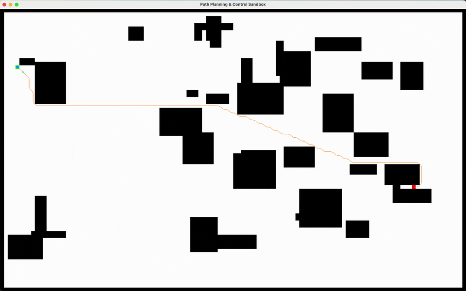

# Path Planning & Control Sandbox (C++/SFML)

Interactive sandbox: A* on a 2D occupancy grid with Chaikin smoothing, tracked by Pure Pursuit or PID and visualized with SFML.

## Features
- A* on 2D occupancy grid (8-connected, Euclidean heuristic)
- Chaikin path smoothing to produce a drivable polyline
- Two controllers: Pure Pursuit and PID lateral
- On-screen overlays: path, robot pose, lookahead target
- CSV telemetry logging (pose, commands, lateral error, path length, plan time)
- PNG map load/save and interactive obstacle editing

For setup, build/run, CLI flags, and IDE tips, see `DEV.md`.

## Controls
- Mouse:
  - LMB = set start
  - Shift + LMB = toggle obstacle (auto-replan)
  - RMB = set goal (if available)
- Keys:
  - `S` / `G` = set Start/Goal at mouse cell
  - `R` = replan and reset pose
  - `Space` = pause/resume
  - `[` / `]` = decrease/increase lookahead
  - `;` / `'` = decrease/increase smoothing iterations (Chaikin)
  - `Up` / `Down` = increase/decrease speed
  - `C` = toggle controller (Pure Pursuit / PID lateral)
  - `P` = toggle raw grid path overlay
  - `V` = toggle lookahead target point overlay
- `N` = generate random rectangles map (deterministic seed advances)
- `T` = toggle deterministic vs time-based random seed
- `1`/`2`/`3` = presets (open field / demo / dense random)
- `O` = save current map to `assets/maps/saved.png`

## Portfolio GIF
Recording guide is in `scripts/record_gif.md` (exports to `assets/demo.gif`).

## Metrics
- CSV columns: `t,x,y,theta,v,omega,err_lat,path_len,plan_ms`
- Visual overlays: smoothed path polyline and lookahead target (toggle with `P`/`V`).

## CSV logging
- File: `logs/run_YYYYMMDD_HHMMSS.csv`
- Header: `t,x,y,theta,v,omega,err_lat,path_len,plan_ms`
- Appends every physics tick (dt ~ 1/120s).

## Roadmap / stretch goals
- Bicycle vs. diff-drive model toggle (+ tuning)
- ROS2 wrapper (publish /map, /path, /cmd_vel)
